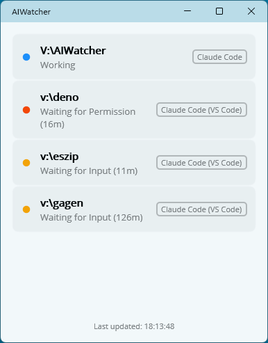

# ai-watcher

A vibe coded desktop app that monitors running Claude Code sessions and shows their real-time status.



**NOTICE**: This has many bugs, but it works ok. Currently supports Windows and macOS. I will add support for Linux soon because I develop on all three operating systems. I would also like to add codex support, but my free pro plan was discontinued and I've been unable to resubscribe with my company credit card for some reason.

## Features

- **Auto-detects Claude Code sessions** — both CLI (terminal) and VS Code extension instances
- **Real-time status** — Working, Waiting for Input, Waiting for Permission, with elapsed time
- **Click to activate** — click any session to bring its window to the foreground
- **Always on top** — stays visible while you work

## Building

Requires .NET 10 SDK with MAUI workload (`dotnet workload install maui`).

### Windows

```
dotnet build -f net10.0-windows10.0.19041.0
dotnet run -f net10.0-windows10.0.19041.0
```

### macOS

Requires Xcode (matching your macOS version).

```
dotnet build -f net10.0-maccatalyst
dotnet run -f net10.0-maccatalyst
```
